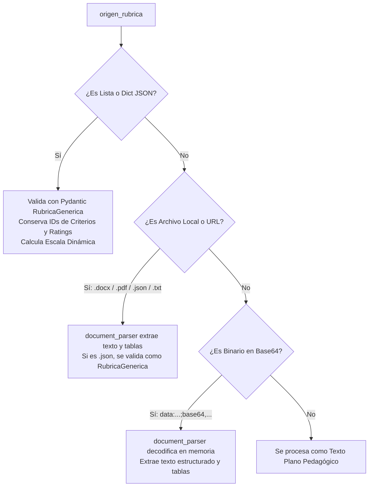

# 📘 Guía de Uso: API de Evaluación de Ensayos con Rúbrica (MCP HUB Server)

Esta guía describe cómo levantar y utilizar el microservicio de evaluación automatizada de ensayos académicos con rúbricas pedagógicas mediante LLMs con fallback inteligente, soporte nativo para **Canvas LMS** y adaptación genérica a cualquier sistema LMS (Moodle, Blackboard, etc.).

---

## 1. 🚀 Levantar el Servidor

Asegúrate de estar en la carpeta raíz del proyecto (`MCP_HUB_SERVER_IA`) y ejecuta:

```powershell
uv run uvicorn API.server:app --reload --port 10000
```

- **URL Base:** `http://localhost:10000`
- **Documentación Interactiva (Swagger UI):** `http://localhost:10000/docs`
- **Documentación Alternativa (Redoc):** `http://localhost:10000/redoc`

> [!NOTE]
> El servidor utiliza las credenciales configuradas en el archivo `.env` de la raíz (`OPENROUTER_API_KEY`, etc.). Si se usa el proveedor `"modelo"`, se activa el sistema de **fallback automático gratuito** con alta disponibilidad entre modelos optimizados de OpenRouter (`nvidia/nemotron-3-nano` ➔ `google/gemma-3-27b-it` ➔ `qwen/qwen-2.5-72b-instruct`).

---

## 2. 📍 Endpoints Disponibles

| Método | Ruta | Descripción |
| :--- | :--- | :--- |
| `POST` | `/context/init` | **Inicializar Contexto Institucional**: Registra sesión institucional y genera `context_id` para reusar en todas las herramientas sin reenviar prompts pesados. |
| `GET` | `/context/{context_id}` | Consulta el estado y las ranuras activas de una sesión de contexto institucional. |
| `POST` | `/context/{context_id}/slot/{slot_name}` | Actualiza o enriquece una ranura de herramienta (`lms`, `zoom`, `crm`, `custom`). |
| `DELETE` | `/context/{context_id}` | Elimina una sesión de contexto institucional. |
| `GET` | `/context/active/current` | Inspecciona el contexto inyectado automáticamente en la solicitud actual. |
| `POST` | `/ensayos/evaluar-flujo-completo` | **Evaluador de Ensayos**: Extrae documentos, califica con rúbrica, inyecta contexto institucional, genera reportes y mapea a Canvas LMS. |
| `POST` | `/ensayos/webhook-canvas` | **Receptor Webhook Canvas LMS**: Endpoint dedicado para recibir eventos de entrega de Canvas (archivo adjunto por URL o texto plano). |
| `POST` | `/llm/chat` | Chat directo con LLMs con soporte para contexto institucional, fallback OpenRouter (`modelo`) y On-Premise (`ollama`). |
| `GET` | `/llm/ollama/status` | Verifica disponibilidad y conexión con el servidor On-Premise local de Ollama. |
| `GET` | `/llm/ollama/models` | Lista modelos instalados en la instancia local de Ollama. |
| `GET` | `/llm/models/free` | Consulta en vivo el catálogo dinámico de modelos gratuitos de OpenRouter con context length, reasoning y ranking. |
| `POST` | `/llm/models/refresh` | Fuerza la actualización inmediata de la caché de modelos gratuitos de OpenRouter. |
| `GET` | `/docs` | Interfaz interactiva de Swagger UI para pruebas directas desde el navegador. |

---

## 3. 📝 Estructura del Payload de Entrada

El servicio admite **dos modalidades de entrada transparentes**: el payload nativo del **Webhook de Canvas LMS** (con archivo o texto) y el formato directo explícito. Ambos pueden enviarse indistintamente a `POST /ensayos/evaluar-flujo-completo` o a `POST /ensayos/webhook-canvas`.

### 3.1. Modalidad A: Payload Nativo de Webhook Canvas LMS

Este formato es emitido directamente por integraciones de Canvas LMS (o flujos intermedios en N8N / Webhooks):

#### Caso 1: Rúbrica + Archivo Adjunto descargable (`attachment.url` para Word .docx o PDF)
```json
{
  "success": true,
  "assignment": {
    "id": "992586",
    "courseId": "79871",
    "name": "[APEB1-30%] Investigación y propuesta: Analice la situación actual de una empresa...",
    "pointsPossible": "10.00",
    "rubric": [
      {
        "id": "_2541",
        "points": 2.5,
        "description": "Contextualización de la institución",
        "ratings": [
          { "id": "blank", "points": 2.5, "description": "Excelente" },
          { "id": "_5282", "points": 2.0, "description": "Muy bueno" }
        ]
      }
    ]
  },
  "submission": {
    "id": "57423885",
    "type": "online_upload",
    "userId": "182199",
    "score": "7.75"
  },
  "attachment": {
    "id": "24498662",
    "name": "TAREA ADMINISTRACIÓN UNIDAD 3 PLANEACIÓN ARIANA ALMEIDA.docx",
    "contentType": "application/vnd.openxmlformats-officedocument.wordprocessingml.document",
    "size": "77585",
    "url": "https://utpl.test.instructure.com/files/24498662/download?download_frd=1&verifier=H4dCJL9zTwxr72n8xh8gvpz5RtZ8TDF4JI6TDJDl",
    "txt": null
  },
  "ai": {
    "score": null,
    "feedback": null,
    "result": null,
    "status": "PENDING"
  }
}
```

#### Caso 2: Rúbrica + Texto directo (`online_text_entry` en `submission.body` o `attachment.txt`)
Para tareas donde el alumno redacta directamente en el editor web de Canvas:
```json
{
  "success": true,
  "assignment": {
    "id": "992586",
    "courseId": "79871",
    "name": "Actividad de Redacción en Línea",
    "pointsPossible": "10.00",
    "rubric": [ ... ]
  },
  "submission": {
    "id": "57423885",
    "type": "online_text_entry",
    "userId": "182199",
    "body": "El presente trabajo analiza la empresa local 'Café Lojano'..."
  },
  "attachment": {
    "url": null,
    "txt": "El presente trabajo analiza la empresa local 'Café Lojano'..."
  }
}
```

---

### 3.2. Modalidad B: Formato Directo Explícito (`origen_ensayo` + `origen_rubrica`)

```json
{
  "s.course_id": "CURSO_IA_101",
  "s.user_id_canvas": "USR_89432",
  "g.assignment_id": "ACT_ENSAYO_FINAL",
  "g.submission_id": "SUB_2026_0987",
  "g.submission_type": "online_upload",
  "id_lms": "CANVAS_PROD",
  "origen_ensayo": "El presente ensayo analiza el impacto de la planeación estratégica en la toma de decisiones empresariales...",
  "origen_rubrica": [
    {
      "id": "_830",
      "points": 2.5,
      "description": "Presenta el contexto y problemática de la empresa",
      "long_description": null,
      "ignore_for_scoring": false,
      "criterion_use_range": false,
      "ratings": [
        { "id": "blank", "points": 2.5, "description": "Cumple", "long_description": "" },
        { "id": "blank_2", "points": 0.0, "description": "No cumple", "long_description": "" }
      ]
    },
    {
      "id": "_7089",
      "points": 2.5,
      "description": "Analiza cómo la planeación influye en la formulación de decisiones estratégicas",
      "long_description": null,
      "ignore_for_scoring": false,
      "criterion_use_range": false,
      "ratings": [
        { "id": "_2068", "points": 2.5, "description": "Cumple", "long_description": "" },
        { "id": "_2159", "points": 0.0, "description": "No cumple", "long_description": "" }
      ]
    }
  ],
  "id_entrega": "SUB_2026_0987",
  "proveedor_llm": "modelo",
  "instrucciones_adicionales": "Evaluar con enfoque pedagógico constructivo y citar evidencia textual del estudiante.",
  "canal_entrega": "local",
  "webhook_lms_url": ""
}
```

---

### 3.3. Modalidad C: Patrón Cero Duplicación (Zero-Duplication Webhook - Máximo Ahorro)

En entornos de producción masiva con cientos de estudiantes por aula, enviar la rúbrica completa (`assignment.rubric`), la descripción logística de la actividad (`assignment.description`) y los datos del curso en cada webhook de cada estudiante representa un desperdicio enorme de ancho de banda y tokens.

Para evitar esto, el HUB permite vincular la entrega al contexto de la tarea mediante el header `X-Context-ID`:
- **Header:** `X-Context-ID: ctx_utpl_curso79871_tarea992586`
- **Payload mínimo enviado por el Webhook de Canvas:**

```json
{
  "submission": {
    "id": "57423885",
    "userId": "182199",
    "type": "online_upload"
  },
  "attachment": {
    "name": "TAREA_FODA_ESTUDIANTE.docx",
    "url": "https://utpl.test.instructure.com/files/24498662/download?download_frd=1&verifier=H4dCJL9zTwxr72n8xh8gvpz5RtZ8TDF4JI6TDJDl"
  }
}
```

*El HUB recupera automáticamente la rúbrica del slot LMS del contexto, descarga el archivo .docx/.pdf del estudiante, y evalúa el ensayo aplicando la escala institucional sin duplicar la rúbrica en la red ni enviar metadatos administrativos al LLM.*

---

## 4. 🔍 Detalle Exhaustivo de Parámetros

### A. Variables de Trazabilidad e Integración LMS

Todas las variables son opcionales y admiten múltiples alias para integrarse sin fricción con consultas SQL, payloads nativos de Canvas o Moodle:

| Variable | Tipo | Default | Alias Aceptados | Descripción |
| :--- | :---: | :---: | :--- | :--- |
| `course_id` | `string` | `null` | `s.course_id`, `course_id`, `id_curso`, `ID_CURSO`, `Id_curso` | Identificador del curso en el LMS. |
| `user_id_canvas` | `string` | `null` | `s.user_id_canvas`, `user_id_canvas`, `id_usuario`, `user_id`, `ID_USUARIO`, `Id_usuario` | Identificador único o ID numérico del estudiante en el LMS. |
| `assignment_id` | `string` | `null` | `g.assignment_id`, `assignment_id`, `id_asignacion`, `id_actividad`, `id_tarea`, `ID_ACTIVIDAD` | Identificador de la tarea o asignación. |
| `assignment_name` | `string` | `null` | `assignment_name`, `titulo_actividad`, `nombre_actividad` | Nombre o título de la actividad académica en el LMS. |
| `submission_id` | `string` | `null` | `g.submission_id`, `submission_id`, `id_submision`, `id_submission`, `ID_SUBMISION`, `Id_submision` | Identificador único del envío del estudiante. |
| `submission_type` | `string` | `null` | `g.submission_type`, `submission_type`, `tipo_envio`, `tipo_submision`, `TIPO_ENVIO` | Tipo de entrega (`online_upload`, `online_text_entry`, `online_url`, etc.). |
| `id_lms` | `string` | `"CANVAS"` | `id_lms`, `ID_LMS`, `sistema_lms` | Nombre del LMS (`Canvas`, `Moodle`, `Blackboard`, etc.). |

> [!TIP]
> **Flexibilidad de Entrada**:
> Puedes enviar estas variables como campos planos en la raíz del JSON (ej: `"s.course_id": "101"`), o agrupadas dentro de un objeto `"datos_lms": { "course_id": "101", ... }`. El backend las normaliza automáticamente en ambos casos.

---

### B. Parámetros de Ensayo, Rúbrica y Configuración

| Variable | Tipo | Obligatorio | Valores Soportados | Descripción |
| :--- | :---: | :---: | :--- | :--- |
| `origen_ensayo` | `string` | **Sí** | • Texto plano directo.<br>• Ruta a archivo local (`.docx`, `.pdf`, `.txt`).<br>• Cadena Base64 (`data:...;base64,...`).<br>• URL HTTP/HTTPS de descarga. | Contenido o referencia al ensayo del estudiante. |
| `origen_rubrica` | `list`, `dict` o `string` | **Sí** | • Lista JSON nativa de Canvas LMS.<br>• Diccionario JSON de rúbrica genérica.<br>• Ruta a archivo local (`.docx`, `.pdf`, `.json`, `.txt`).<br>• Cadena Base64 (`data:...;base64,...`).<br>• URL de descarga.<br>• Texto plano con descripción de criterios. | Contenido o referencia a la rúbrica evaluadora. |
| `id_entrega` | `string` | No | `string` libre (ej: `"SUB_001"`). | Carpeta de almacenamiento local en `storage/evaluaciones/`. Si no se envía pero se provee `submission_id`, se sincroniza con este último. |
| `proveedor_llm` | `string` | No | • `"modelo"` (Default - Fallback gratuito OpenRouter).<br>• `"gemma"` / `"gemini"` (Google).<br>• `"deepseek"` (DeepSeek Chat).<br>• `"openai"` (OpenAI GPT-4o). | Motor de inteligencia artificial para la evaluación. |
| `instrucciones_adicionales` | `string` | No | Texto libre. | Indicaciones pedagógicas complementarias para guiar la corrección del LLM. |
| `canal_entrega` | `string` | No | • `"local"` (Default - Guarda JSON y Markdown en disco).<br>• `"webhook"` (Envía el resultado vía HTTP POST a `webhook_lms_url`).<br>• `"todos"` (Guarda en disco y notifica al webhook). | Canal de persistencia y notificación de la evaluación. |
| `webhook_lms_url` | `string` | No | URL válida `https://...` | Endpoint de destino si `canal_entrega` es `"webhook"` o `"todos"`. |

---

## 5. 🧩 Modelos Pydantic de Rúbricas (Canvas y Genéricas)

El sistema cuenta con un modelo Pydantic polimórfico [RubricaGenerica](file:///c:/Users/jeguaman2/IA_GENERATIVA/MCP_HUB_SERVER_IA/API/services/essay_evaluator_mcp.py#L79-L138) que valida y procesa tanto la estructura nativa de Canvas LMS como rúbricas genéricas de cualquier otro entorno.

### A. Estructura Pydantic Interna

```python
class NivelRatingRubrica(BaseModel):
    id: Optional[str]               # ID en Canvas/LMS (ej: 'blank', '_2068')
    points: float                   # Puntaje asignado al nivel (ej: 2.5)
    description: str                # Nombre o resumen del nivel (ej: 'Cumple', 'No cumple')
    long_description: Optional[str] # Detalle descriptivo del nivel

class CriterioRubrica(BaseModel):
    id: Optional[str]                     # ID del criterio (ej: '_830')
    points: float                         # Puntaje máximo del criterio
    description: str                      # Título o enunciado del criterio
    long_description: Optional[str]       # Guía pedagógica extendida
    ignore_for_scoring: Optional[bool]    # Si es True, no suma a la nota final
    criterion_use_range: Optional[bool]   # Si admite rangos intermedios
    ratings: List[NivelRatingRubrica]     # Escala de niveles de desempeño

class RubricaGenerica(BaseModel):
    titulo: Optional[str]                 # Título general de la rúbrica
    points_possible: Optional[float]      # Escala máxima total
    criterios: List[CriterioRubrica]      # Lista de criterios
```

### B. Cálculo Dinámico de Escala de Calificación

El evaluador **no impone una escala rígida de 20 puntos**. En su lugar:
1. `RubricaGenerica.calcular_escala_maxima()` suma los `points` de cada criterio (omitiendo aquellos con `ignore_for_scoring = True`).
2. Si la rúbrica de Canvas suma 5 puntos, la escala máxima será 5.0. Si suma 10 o 100 puntos, la escala máxima será exactamente 10.0 o 100.0.
3. El LLM es instruido dinámicamente para calificar dentro de los límites y niveles exactos de la rúbrica.

---

## 6. 🎛 Ejemplos JSON Completos para Cada Caso de Uso

A continuación se presentan los payloads JSON completos y listos para copiar y pegar en Swagger UI, Postman o cualquier cliente HTTP para cada una de las modalidades admitidas.



---

### Caso 1: Rúbrica Nativa Canvas LMS con Trazabilidad Completa (`s.*` y `g.*`)
> **Uso típico**: Integración estándar con Canvas LMS. Envía la rúbrica como una lista de criterios JSON con sus ratings y los identificadores de trazabilidad con prefijos de tabla (`s.course_id`, `g.assignment_id`, etc.). El ensayo se envía como texto plano directo.

```json
{
  "s.course_id": "CURSO_CANVAS_101",
  "s.user_id_canvas": "EST_89432",
  "g.assignment_id": "ACT_ENSAYO_FINAL",
  "g.submission_id": "SUB_CANVAS_7788",
  "g.submission_type": "online_upload",
  "id_lms": "CANVAS_PROD",
  "origen_ensayo": "El presente ensayo analiza el impacto de la planeación estratégica en la toma de decisiones empresariales. Se examinan los factores internos y externos que condicionan la sostenibilidad de las organizaciones en entornos competitivos. Se concluye que sin una planificación rigurosa, las decisiones operativas carecen de dirección...",
  "origen_rubrica": [
    {
      "id": "_830",
      "points": 2.5,
      "description": "Presenta el contexto y problemática de la empresa",
      "long_description": "El estudiante describe con claridad el entorno empresarial y formula la problemática central.",
      "ignore_for_scoring": false,
      "criterion_use_range": false,
      "ratings": [
        {
          "id": "blank",
          "points": 2.5,
          "description": "Cumple",
          "long_description": "Describe exhaustivamente el contexto y formula con precisión el problema."
        },
        {
          "id": "blank_2",
          "points": 0.0,
          "description": "No cumple",
          "long_description": "Omite el contexto o la problemática carece de relación con el tema."
        }
      ]
    },
    {
      "id": "_7089",
      "points": 2.5,
      "description": "Analiza cómo la planeación influye en la formulación de decisiones estratégicas",
      "long_description": "Demuestra pensamiento crítico vinculando los objetivos de largo plazo con decisiones tácticas.",
      "ignore_for_scoring": false,
      "criterion_use_range": false,
      "ratings": [
        {
          "id": "_2068",
          "points": 2.5,
          "description": "Cumple",
          "long_description": "Analiza con profundidad la influencia estratégica de la planeación."
        },
        {
          "id": "_2159",
          "points": 0.0,
          "description": "No cumple",
          "long_description": "No evidencia análisis de la influencia en las decisiones."
        }
      ]
    }
  ],
  "id_entrega": "SUB_CANVAS_7788",
  "proveedor_llm": "modelo",
  "instrucciones_adicionales": "Evaluar con enfoque pedagógico formativo y citar evidencia textual del ensayo.",
  "canal_entrega": "local"
}
```

---

### Caso 2: Rúbrica Genérica LMS (Estructura Objeto con Criterios en Español o Inglés)
> **Uso típico**: Plataformas como Moodle, Blackboard, Google Classroom o sistemas propios donde la rúbrica viene estructurada como un objeto que agrupa un título general y la lista de criterios.

```json
{
  "id_lms": "MOODLE_PROD",
  "course_id": "MDL_BIO_2026",
  "user_id_canvas": "ALU_4501",
  "assignment_id": "TAREA_GENETICA_02",
  "submission_id": "ENVIO_MDL_9021",
  "submission_type": "online_text_entry",
  "origen_ensayo": "Las terapias de edición genética mediante CRISPR-Cas9 representan un cambio de paradigma en la medicina moderna. Esta tecnología permite modificar secuencias de ADN con alta precisión, abriendo posibilidades terapéuticas para enfermedades monogénicas. Sin embargo, surgen dilemas bioéticos cruciales en relación con la modificación de la línea germinal humana...",
  "origen_rubrica": {
    "titulo": "Rúbrica de Ensayo Científico y Bioética",
    "points_possible": 20.0,
    "criterios": [
      {
        "id": "crit_marco_teorico",
        "points": 5.0,
        "description": "Rigor conceptual y fundamentación teórica",
        "long_description": "Uso preciso de terminología científica y referencias bibliográficas actualizadas.",
        "ratings": [
          { "id": "rat_teoria_alta", "points": 5.0, "description": "Sobresaliente: Marco teórico riguroso y actualizado" },
          { "id": "rat_teoria_media", "points": 3.0, "description": "Aceptable: Conceptos correctos pero referencias limitadas" },
          { "id": "rat_teoria_baja", "points": 1.0, "description": "Insuficiente: Errores conceptuales notorios" }
        ]
      },
      {
        "id": "crit_argumentacion",
        "points": 10.0,
        "description": "Profundidad argumentativa y dilemas bioéticos",
        "long_description": "Capacidad crítica para sopesar beneficios médicos frente a riesgos éticos.",
        "ratings": [
          { "id": "rat_arg_alta", "points": 10.0, "description": "Excelente análisis crítico y ponderación ética" },
          { "id": "rat_arg_media", "points": 6.5, "description": "Argumentación básica con poca discusión de dilemas" },
          { "id": "rat_arg_baja", "points": 2.0, "description": "Argumentación superficial sin justificación ética" }
        ]
      },
      {
        "id": "crit_conclusiones",
        "points": 5.0,
        "description": "Síntesis y conclusiones prospectivas",
        "ratings": [
          { "id": "rat_conc_alta", "points": 5.0, "description": "Conclusiones coherentes y prospectiva sólida" },
          { "id": "rat_conc_baja", "points": 1.5, "description": "Conclusiones desconectadas del cuerpo del ensayo" }
        ]
      }
    ]
  },
  "proveedor_llm": "modelo",
  "canal_entrega": "local"
}
```

---

### Caso 3: Documentos en Archivos Locales en Disco (`.docx` o `.pdf`)
> **Uso típico**: Procesamiento por lotes o scripts locales donde los ensayos de los alumnos y/o las rúbricas se encuentran descargados en el sistema de archivos del servidor.

```json
{
  "s.course_id": "CURSO_DERECHO_301",
  "s.user_id_canvas": "EST_33091",
  "g.assignment_id": "ENSAYO_JURISPRUDENCIA",
  "g.submission_id": "SUB_DISCO_001",
  "g.submission_type": "online_upload",
  "id_lms": "CANVAS_PROD",
  "origen_ensayo": "C:\\evaluaciones\\entregas\\ensayo_estudiante_33091.docx",
  "origen_rubrica": "C:\\evaluaciones\\rubricas\\rubrica_evaluacion_derecho.docx",
  "id_entrega": "SUB_DISCO_001",
  "proveedor_llm": "modelo",
  "canal_entrega": "local"
}
```

> [!NOTE]
> El extractor `document_parser.py` detecta automáticamente la extensión del archivo, lee los párrafos e interpreta todas las tablas tabuladas del documento DOCX o PDF sin necesidad de configuración adicional.

---

### Caso 4: Documentos Binarios en Base64 (Sin guardar en disco)
> **Uso típico**: Microservicios, arquitecturas sin servidor (AWS Lambda, Google Cloud Run) o webhooks que transmiten archivos binarios directamente en memoria en formato Data URI RFC 2397 o Base64 estándar.

```json
{
  "s.course_id": "CURSO_CONTABILIDAD_202",
  "s.user_id_canvas": "EST_77123",
  "g.assignment_id": "AUDITORIA_FINAL",
  "g.submission_id": "SUB_B64_5521",
  "g.submission_type": "online_upload",
  "id_lms": "CANVAS_PROD",
  "origen_ensayo": "data:application/pdf;base64,JVBERi0xLjQKJcfsj6IKMSAwIG9iago8PAovVHlwZSAvQ2F0YWxvZwovUGFnZXMgMiAwIFI...",
  "origen_rubrica": "data:application/vnd.openxmlformats-officedocument.wordprocessingml.document;base64,UEsDBBQAAAAIAI123456...",
  "proveedor_llm": "modelo",
  "canal_entrega": "local"
}
```

> [!TIP]
> Puedes enviar el binario con el prefijo Data URI (ej. `data:application/pdf;base64,...`) o como cadena Base64 pura. El motor detecta los marcadores binarios de formato ZIP (`.docx`) y cabeceras PDF de forma autónoma.

---

### Caso 5: Ensayo y Rúbrica en Texto Plano Directo (Formato Rápido / Docente)
> **Uso típico**: Evaluaciones ágiles, pruebas interactivas en Swagger o cuando el docente redacta la rúbrica de forma cualitativa sin IDs de sistema.

```json
{
  "s.course_id": "CURSO_LITERATURA_101",
  "s.user_id_canvas": "USR_5502",
  "g.assignment_id": "ENSAYO_DON_QUIJOTE",
  "g.submission_id": "ENTREGA_TEXTO_01",
  "id_lms": "CANVAS",
  "origen_ensayo": "En la novela Don Quijote de la Mancha, Cervantes contrapone el idealismo caballeresco con el pragmatismo de Sancho Panza. A lo largo de la obra se evidencia cómo la locura quijotesca actúa como un mecanismo de subversión frente a la rígida estructura social del Siglo de Oro español. Los diálogos entre el caballero andante y su escudero reflejan una dialéctica permanente entre ilusión y realidad...",
  "origen_rubrica": "Criterio 1: Contextualización histórica y literaria de la obra (Máximo 5 puntos).\nCriterio 2: Análisis crítico y dialéctica de los personajes principales (Máximo 10 puntos).\nCriterio 3: Coherencia argumentativa, redacción y estilo académico (Máximo 5 puntos).",
  "proveedor_llm": "modelo",
  "instrucciones_adicionales": "Enfatizar en la coherencia de las citas y la corrección gramatical.",
  "canal_entrega": "local"
}
```

---

### Caso 6: Trazabilidad Agrupada en el Sub-objeto `datos_lms`
> **Uso típico**: Cuando el cliente o middleware prefiere encapsular los metadatos institucionales dentro de un objeto JSON estructurado en vez de enviar campos planos en la raíz.

```json
{
  "datos_lms": {
    "id_lms": "CANVAS_INSTITUCIONAL",
    "course_id": "CURSO_INGENIERIA_501",
    "user_id_canvas": "ING_8849",
    "assignment_id": "PROYECTO_CAPSTONE",
    "submission_id": "SUB_NESTED_091",
    "submission_type": "online_upload"
  },
  "origen_ensayo": "El presente informe técnico describe la arquitectura de microservicios desarrollada para la gestión de datos distribuidos en alta concurrencia. Se emplearon patrones como Circuit Breaker y colas asíncronas para garantizar resiliencia...",
  "origen_rubrica": [
    {
      "id": "_capstone_arch",
      "points": 10.0,
      "description": "Viabilidad y resiliencia de la arquitectura de software",
      "ratings": [
        { "id": "r_alto", "points": 10.0, "description": "Arquitectura modular y tolerante a fallos" },
        { "id": "r_medio", "points": 6.0, "description": "Arquitectura funcional pero con puntos únicos de fallo" },
        { "id": "r_bajo", "points": 2.0, "description": "Diseño monolítico sin justificación" }
      ]
    },
    {
      "id": "_capstone_test",
      "points": 10.0,
      "description": "Estrategia de pruebas y métricas de rendimiento",
      "ratings": [
        { "id": "r2_alto", "points": 10.0, "description": "Pruebas de estrés y benchmarking documentados" },
        { "id": "r2_bajo", "points": 3.0, "description": "Sin métricas claras ni pruebas de carga" }
      ]
    }
  ],
  "proveedor_llm": "modelo",
  "canal_entrega": "local"
}
```

---

### Caso 7: Descarga Remota desde URLs Públicas (HTTP / HTTPS)
> **Uso típico**: Cuando el LMS o un servicio cloud (Amazon S3, Google Cloud Storage, Azure Blob) genera URLs públicas o prefirmadas temporales para acceder a los archivos.

```json
{
  "s.course_id": "CURSO_HISTORIA_404",
  "s.user_id_canvas": "EST_2291",
  "g.assignment_id": "ENSAYO_GUERRA_FRIA",
  "g.submission_id": "SUB_URL_8830",
  "g.submission_type": "online_url",
  "id_lms": "CANVAS",
  "origen_ensayo": "https://storage.universidad.edu/entregas/2026/ensayo_estudiante_2291.pdf",
  "origen_rubrica": "https://storage.universidad.edu/rubricas/rubrica_historia_2026.json",
  "proveedor_llm": "modelo",
  "canal_entrega": "local"
}
```

---

### Caso 8: Notificación Automática vía Webhook (`canal_entrega: "webhook"` o `"todos"`)
> **Uso típico**: Flujos totalmente desacoplados. Tras finalizar la evaluación con IA, el servidor ejecuta un `POST` HTTP enviando el resultado completo a la URL del webhook especificada.

```json
{
  "s.course_id": "CURSO_ECONOMIA_201",
  "s.user_id_canvas": "EST_99014",
  "g.assignment_id": "ASG_POLITICA_MONETARIA",
  "g.submission_id": "SUB_WEBHOOK_110",
  "g.submission_type": "online_upload",
  "id_lms": "CANVAS_PROD",
  "origen_ensayo": "El impacto de la elevación de tasas de interés por parte del banco central incide directamente en la contracción del crédito de consumo y la desaceleración de la inflación...",
  "origen_rubrica": [
    {
      "id": "_rub_eco_01",
      "points": 5.0,
      "description": "Dominio de modelos macroeconómicos",
      "ratings": [
        { "id": "nivel_optimo", "points": 5.0, "description": "Aplica modelos macroeconómicos con precisión" },
        { "id": "nivel_deficiente", "points": 1.0, "description": "Errores graves en la interpretación de variables" }
      ]
    }
  ],
  "canal_entrega": "todos",
  "webhook_lms_url": "https://mi-lms.universidad.edu/api/v1/webhooks/recepcion-calificaciones",
  "proveedor_llm": "modelo"
}
```

---

## 7. 📤 Estructura de la Respuesta JSON

La respuesta contiene la calificación final, los comentarios cualitativos, las evidencias textuales citadas y el bloque nativo `rubric_assessment_canvas`:

```json
{
  "pipeline": "completado",
  "status": "success",
  "modelo_utilizado": "nvidia/nemotron-3-nano-omni-30b-a3b-reasoning:free",
  
  "datos_lms": {
    "id_lms": "CANVAS_PROD",
    "course_id": "CURSO_CANVAS_101",
    "user_id_canvas": "EST_99482",
    "assignment_id": "ASG_ENSAYO_01",
    "submission_id": "SUB_CANVAS_7788",
    "submission_type": "online_upload"
  },

  "id_lms": "CANVAS_PROD",
  "course_id": "CURSO_CANVAS_101",
  "user_id_canvas": "EST_99482",
  "assignment_id": "ASG_ENSAYO_01",
  "submission_id": "SUB_CANVAS_7788",
  "submission_type": "online_upload",
  "id_entrega": "SUB_CANVAS_7788",

  "nota_final": 5.0,
  "escala_maxima": 5.0,

  "criterios": [
    {
      "id_criterio": "_830",
      "criterio": "Presenta el contexto y problemática de la empresa",
      "id_nivel": "blank",
      "nivel_alcanzado": "Cumple",
      "puntaje_obtenido": 2.5,
      "puntaje_maximo": 2.5,
      "justificacion": "El ensayo introduce claramente la problemática organizacional analizada.",
      "evidencias_en_texto": [
        "El presente ensayo analiza el contexto y planeación estratégica..."
      ]
    },
    {
      "id_criterio": "_7089",
      "criterio": "Analiza cómo la planeación influye en la formulación de decisiones estratégicas",
      "id_nivel": "_2068",
      "nivel_alcanzado": "Cumple",
      "puntaje_obtenido": 2.5,
      "puntaje_maximo": 2.5,
      "justificacion": "Se demuestra la relación causa-efecto entre plan estratégico y decisiones operativas.",
      "evidencias_en_texto": [
        "Se concluye que las decisiones empresariales dependen del diagnóstico inicial..."
      ]
    }
  ],

  "rubric_assessment_canvas": {
    "_830": {
      "points": 2.5,
      "rating_id": "blank",
      "comments": "El ensayo introduce claramente la problemática organizacional analizada."
    },
    "_7089": {
      "points": 2.5,
      "rating_id": "_2068",
      "comments": "Se demuestra la relación causa-efecto entre plan estratégico y decisiones operativas."
    }
  },

  "fortalezas": [
    "Comprensión clara de los conceptos de planeación estratégica.",
    "Adecuada contextualización de la problemática empresarial."
  ],
  "areas_mejora": [
    "Profundizar en casos empíricos y cursos de acción específicos."
  ],
  "resumen_retroalimentacion": "El estudiante presenta un análisis ordenado y coherente que cumple satisfactoriamente con los criterios de la rúbrica.",
  "recomendaciones": "Revisar lecturas sobre planeación táctica y operativa para complementar futuras entregas.",

  "documentos_info": {
    "ensayo_tipo": "text",
    "ensayo_palabras": 85,
    "rubrica_tipo": "lms_rubric_json"
  },

  "evaluacion": {
    "id_entrega": "SUB_CANVAS_7788",
    "estudiante": "EST_99482",
    "titulo_ensayo": "Impacto de la planeación estratégica en la toma de decisiones empresariales",
    "nota_final": 5.0,
    "escala_maxima": 5.0,
    "criterios": [
      {
        "id_criterio": "_830",
        "id_nivel": "blank",
        "criterio": "Presenta el contexto y problemática de la empresa",
        "nivel_alcanzado": "Cumple",
        "puntaje_obtenido": 2.5,
        "puntaje_maximo": 2.5,
        "justificacion": "El ensayo introduce claramente la problemática organizacional analizada.",
        "evidencias_en_texto": [
          "El presente ensayo analiza el contexto y planeación estratégica..."
        ]
      },
      {
        "id_criterio": "_7089",
        "id_nivel": "_2068",
        "criterio": "Analiza cómo la planeación influye en la formulación de decisiones estratégicas",
        "nivel_alcanzado": "Cumple",
        "puntaje_obtenido": 2.5,
        "puntaje_maximo": 2.5,
        "justificacion": "Se demuestra la relación causa-efecto entre plan estratégico y decisiones operativas.",
        "evidencias_en_texto": [
          "Se concluye que las decisiones empresariales dependen del diagnóstico inicial..."
        ]
      }
    ],
    "fortalezas": [
      "Comprensión clara de los conceptos de planeación estratégica.",
      "Adecuada contextualización de la problemática empresarial."
    ],
    "areas_mejora": [
      "Profundizar en casos empíricos y cursos de acción específicos."
    ],
    "resumen_retroalimentacion": "El estudiante presenta un análisis ordenado y coherente que cumple satisfactoriamente con los criterios de la rúbrica.",
    "recomendaciones": [
      "Revisar lecturas sobre planeación táctica y operativa para complementar futuras entregas."
    ],
    "rubric_assessment_canvas": {
      "_830": { "points": 2.5, "rating_id": "blank", "comments": "El ensayo introduce claramente la problemática organizacional analizada." },
      "_7089": { "points": 2.5, "rating_id": "_2068", "comments": "Se demuestra la relación causa-efecto entre plan estratégico y decisiones operativas." }
    }
  },

  "reporte": {
    "status": "success",
    "id_entrega": "SUB_CANVAS_7788",
    "archivos_locales": {
      "json": "C:\\...\\storage\\evaluaciones\\SUB_CANVAS_7788\\reporte_evaluacion.json",
      "markdown": "C:\\...\\storage\\evaluaciones\\SUB_CANVAS_7788\\reporte_evaluacion.md"
    },
    "notificacion_lms": {
      "canal": "local",
      "enviado": false
    }
  }
}
```

> [!IMPORTANT]
> **Integración Directa con la API REST de Canvas LMS**:
> El objeto generado `rubric_assessment_canvas` coincide de forma exacta con la especificación oficial de Canvas:
> ```http
> PUT /api/v1/courses/{course_id}/assignments/{assignment_id}/submissions/{user_id}
> Content-Type: application/json
> 
> {
>   "rubric_assessment": {
>     "_830": { "points": 2.5, "rating_id": "blank", "comments": "..." },
>     "_7089": { "points": 2.5, "rating_id": "_2068", "comments": "..." }
>   }
> }
> ```

---

## 8. 💻 Ejemplos de Código para Invocar la API

### Ejemplo 1: PowerShell (Windows)

```powershell
$payload = @{
    "s.course_id" = "CURSO_101"
    "s.user_id_canvas" = "EST_99482"
    "g.assignment_id" = "ASG_01"
    "g.submission_id" = "SUB_7788"
    "g.submission_type" = "online_upload"
    "id_lms" = "CANVAS_PROD"
    "origen_ensayo" = "El presente ensayo analiza el contexto y planeación estratégica de la empresa..."
    "origen_rubrica" = @(
        @{
            id = "_830"
            points = 2.5
            description = "Presenta el contexto y problemática de la empresa"
            ratings = @(
                @{ id = "blank"; points = 2.5; description = "Cumple" },
                @{ id = "blank_2"; points = 0.0; description = "No cumple" }
            )
        },
        @{
            id = "_7089"
            points = 2.5
            description = "Analiza cómo la planeación influye en la formulación de decisiones estratégicas"
            ratings = @(
                @{ id = "_2068"; points = 2.5; description = "Cumple" },
                @{ id = "_2159"; points = 0.0; description = "No cumple" }
            )
        }
    )
    "proveedor_llm" = "modelo"
    "canal_entrega" = "local"
} | ConvertTo-Json -Depth 6

$response = Invoke-RestMethod -Uri "http://localhost:10000/ensayos/evaluar-flujo-completo" `
                              -Method POST `
                              -Headers @{"Content-Type"="application/json"} `
                              -Body $payload

Write-Host "Nota Final:" $response.nota_final "/" $response.escala_maxima
Write-Host "Modelo Utilizado:" $response.modelo_utilizado
$response.rubric_assessment_canvas | ConvertTo-Json
```

---

### Ejemplo 2: cURL (Bash / Linux / Git Bash)

```bash
curl -X POST "http://localhost:10000/ensayos/evaluar-flujo-completo" \
  -H "Content-Type: application/json" \
  -d '{
    "s.course_id": "CURSO_101",
    "s.user_id_canvas": "EST_99482",
    "g.assignment_id": "ASG_01",
    "g.submission_id": "SUB_7788",
    "g.submission_type": "online_upload",
    "id_lms": "CANVAS_PROD",
    "origen_ensayo": "Texto del ensayo académico del estudiante...",
    "origen_rubrica": [
      {
        "id": "_830",
        "points": 2.5,
        "description": "Contexto y problemática",
        "ratings": [
          { "id": "blank", "points": 2.5, "description": "Cumple" },
          { "id": "blank_2", "points": 0.0, "description": "No cumple" }
        ]
      }
    ],
    "proveedor_llm": "modelo",
    "canal_entrega": "local"
  }'
```

---

### Ejemplo 3: Python (`httpx` o `requests`)

```python
import httpx

url = "http://localhost:10000/ensayos/evaluar-flujo-completo"

payload = {
    "s.course_id": "CURSO_101",
    "s.user_id_canvas": "EST_99482",
    "g.assignment_id": "ASG_01",
    "g.submission_id": "SUB_7788",
    "g.submission_type": "online_upload",
    "origen_ensayo": "El presente ensayo analiza el impacto de la planeación...",
    "origen_rubrica": [
        {
            "id": "_830",
            "points": 2.5,
            "description": "Presenta el contexto y problemática de la empresa",
            "ratings": [
                {"id": "blank", "points": 2.5, "description": "Cumple"},
                {"id": "blank_2", "points": 0.0, "description": "No cumple"}
            ]
        }
    ],
    "proveedor_llm": "modelo",
    "canal_entrega": "local"
}

with httpx.Client(timeout=120.0) as client:
    response = client.post(url, json=payload)
    resultado = response.json()
    print(f"Nota: {resultado['nota_final']} / {resultado['escala_maxima']}")
    print(f"Canvas Rubric Assessment: {resultado['rubric_assessment_canvas']}")
```

---

### Ejemplo 4: JavaScript / TypeScript (`fetch`)

```javascript
const payload = {
  "s.course_id": "CURSO_101",
  "s.user_id_canvas": "EST_99482",
  "g.assignment_id": "ASG_01",
  "g.submission_id": "SUB_7788",
  "g.submission_type": "online_upload",
  "origen_ensayo": "El presente ensayo analiza...",
  "origen_rubrica": [
    {
      "id": "_830",
      "points": 2.5,
      "description": "Presenta el contexto y problemática",
      "ratings": [
        { "id": "blank", "points": 2.5, "description": "Cumple" },
        { "id": "blank_2", "points": 0.0, "description": "No cumple" }
      ]
    }
  ],
  "proveedor_llm": "modelo"
};

const response = await fetch("http://localhost:10000/ensayos/evaluar-flujo-completo", {
  method: "POST",
  headers: { "Content-Type": "application/json" },
  body: JSON.stringify(payload)
});

const data = await response.json();
console.log("Nota final:", data.nota_final);
console.log("Rubric Assessment Canvas:", data.rubric_assessment_canvas);
```

---

## 9. 📁 Archivos Generados en Disco (`storage/evaluaciones/`)

Cada evaluación ejecutada con `canal_entrega: "local"` o `"todos"` crea una carpeta con el ID de la entrega (`id_entrega` o `submission_id`):

```
storage/
└── evaluaciones/
    └── SUB_CANVAS_7788/
        ├── reporte_evaluacion.json   # JSON completo con datos LMS, criterios, evidencias y rubric_assessment_canvas
        └── reporte_evaluacion.md     # Informe pedagógico visual en Markdown listo para descargar o imprimir
```

El informe Markdown incluye:
1. Encabezado con datos del curso, estudiante, tarea, envío y modelo IA utilizado.
2. Resumen ejecutivo con nota obtenida sobre la escala máxima calculada.
3. Tabla de evaluación de criterios con niveles, puntajes y justificación.
4. Citas textuales extraídas del ensayo como respaldo probatorio.
5. Secciones formativas de Fortalezas, Áreas de Mejora y Recomendaciones.
6. Bloque JSON estructurado de integración con Canvas LMS.

---

## 10. 📡 Integración Asíncrona con ActiveMQ Artemis (STOMP)

Para arquitecturas basadas en eventos o colas empresariales, el servicio [artemis_adapter.py](file:///c:/Users/jeguaman2/IA_GENERATIVA/MCP_HUB_SERVER_IA/API/services/artemis_adapter.py) escucha y responde de manera desacoplada:

- **Cola de Entrada:** `/queue/lms.evaluaciones.in` (Selector JMS: `tipo = 'calificar ensayos IA'`)
- **Cola de Salida:** `/queue/lms.calificaciones.out` (o header `reply-to`)
- **Mapeo de Variables:** Extrae `s.course_id`, `s.user_id_canvas`, `g.assignment_id`, `g.submission_id`, `g.submission_type` y procesa rúbricas JSON o binarias.
- **Respuesta:** Encola el resultado completo incluyendo `rubric_assessment_canvas` y preservando el `correlation-id` de la solicitud.

---

## 11. 🤖 Servicios de Inferencia LLM y Catálogo Dinámico (`/llm`)

El servidor incorpora un subsistema de inteligencia artificial con **catálogo dinámico en tiempo real**, **scoring de idoneidad**, **caché en memoria con TTL** y **fallback resiliente** ante saturaciones o fallos de proveedores en OpenRouter.

### 11.1. `GET /llm/models/free` - Consulta en Vivo del Catálogo de Modelos Gratuitos

Consulta directamente la API oficial de OpenRouter (`https://openrouter.ai/api/v1/models`) para descubrir los modelos gratuitos actualmente disponibles, aplicando filtros de idoneidad y ordenándolos mediante un algoritmo de scoring.

#### Parámetros Query:
- `refresh` (opcional, booleano, default `false`): Si es `true`, ignora la caché local y fuerza una consulta fresca a OpenRouter.

#### Ejemplo de Solicitud (cURL):
```bash
curl -X GET "http://localhost:10000/llm/models/free"
```

#### Ejemplo de Solicitud Forzando Recarga:
```bash
curl -X GET "http://localhost:10000/llm/models/free?refresh=true"
```

#### Estructura de Respuesta Exitosa (`200 OK`):
```json
{
  "status": "success",
  "total_free_models": 21,
  "last_updated": "2026-09-24T15:14:38Z",
  "cache_ttl_seconds": 1800,
  "cached": true,
  "models": [
    {
      "id": "nvidia/nemotron-3.5-lightning:free",
      "name": "NVIDIA: Nemotron 3.5 Lightning (free)",
      "description": "NVIDIA Nemotron 3.5 Lightning is an open mixture-of-experts model...",
      "context_length": 1000000,
      "provider_brand": "nvidia",
      "is_multimodal": false,
      "modality": "text->text",
      "supports_reasoning": true,
      "supports_tools": true,
      "supports_structured_outputs": false,
      "pricing": {
        "prompt": "0",
        "completion": "0"
      },
      "expiration_date": null
    },
    {
      "id": "qwen/qwen3.8-27b:free",
      "name": "Qwen 3.8 27B (free)",
      "description": "Qwen 3.8 is an instruction-tuned language model...",
      "context_length": 262144,
      "provider_brand": "qwen",
      "is_multimodal": false,
      "modality": "text->text",
      "supports_reasoning": true,
      "supports_tools": true,
      "supports_structured_outputs": true,
      "pricing": {
        "prompt": "0",
        "completion": "0"
      },
      "expiration_date": null
    }
  ]
}
```

---

### 11.2. `POST /llm/models/refresh` - Recarga Forzada de Caché

Invalida la caché en memoria del servidor y ejecuta una petición inmediata a OpenRouter para reconstruir la lista priorizada de modelos de contingencia.

#### Ejemplo de Solicitud (cURL):
```bash
curl -X POST "http://localhost:10000/llm/models/refresh"
```

---

### 11.3. `POST /llm/chat` - Chat Directo con Fallback Inteligente

Permite interactuar con modelos de lenguaje. Cuando se utiliza el proveedor `"openrouter-free"` o `"modelo"`, el sistema selecciona automáticamente el mejor modelo disponible del catálogo dinámico y, si ocurre cualquier saturación o fallo upstream, desciende en tiempo real por la cola de modelos de respaldo.

#### Propiedades del Payload de Entrada:
- `prompt` (obligatorio, string): Pregunta o instrucción para el modelo.
- `provider` (opcional, string, default `"deepseek"`):
  - `"openrouter-free"`, `"modelo"` o `"free"`: Fallback dinámico automático entre modelos gratuitos de OpenRouter (NVIDIA, Qwen, Gemma, Cohere, Liquid, etc.).
  - `"deepseek"`: DeepSeek Chat vía OpenRouter.
  - `"gemini"` o `"gemma"`: Google Gemma vía OpenRouter.
  - `"openai"`: OpenAI GPT.
- `model` (opcional, string): Modelo preferido para intentar en primera instancia (ej: `"nvidia/nemotron-3.5-lightning:free"`). Si se envían alias genéricos como `"modelo"` o `"free"`, el sistema los ignora de forma segura y usa el orden priorizado óptimo.

#### Ejemplo de Solicitud:
```json
{
  "provider": "openrouter-free",
  "prompt": "¿Por qué el 42 es la respuesta al sentido de la vida?",
  "model": "nvidia/nemotron-3.5-lightning:free"
}
```

#### Ejemplo de Respuesta Exitosa con Registro de Fallback:
```json
{
  "provider": "openrouter-free",
  "model_used": "nvidia/nemotron-3.5-lightning:free",
  "model": "nvidia/nemotron-3.5-lightning:free",
  "prompt": "¿Por qué el 42 es la respuesta al sentido de la vida?",
  "response": "El número 42 es célebre por la novela de ciencia ficción 'The Hitchhiker's Guide to the Galaxy' de Douglas Adams...",
  "text": "El número 42 es célebre por la novela de ciencia ficción...",
  "reasoning_details": null,
  "fallback_attempts": [
    {
      "model": "nvidia/nemotron-3-nano-omni-30b-a3b-reasoning:free",
      "status_code": 200,
      "motivo": "Error upstream en 200 (502)",
      "detalle": "Upstream error from Nvidia: ResourceExhausted: Worker local total request limit reached (16/16)"
    }
  ]
}
```

> **Garantía de Tolerancia a Fallos y Conmutación Ultrarrápida (Hedged Racing):**  
> 1. **Carrera Especulativa (Hedged Requests):** Si el modelo prioritario no devuelve respuesta en **3.5 segundos** (`LLM_SOFT_TIMEOUT`), el sistema no aborta la llamada sino que dispara inmediatamente el siguiente mejor modelo en paralelo. El primero que responda con éxito gana la carrera y cancela las tareas restantes.
> 2. **Circuit Breaker & Health Tracker:** Si un modelo falla con 429, 502 o agota el timeout de 12s, entra en enfriamiento automático (*cooldown*) de 3 minutos. Las peticiones posteriores no intentarán ese modelo mientras esté degradado.
> 3. **Detección de Errores Upstream en 200:** Si un proveedor responde con HTTP 200 pero incluye un error en el JSON (ej. saturación 502 de workers de NVIDIA) o devuelve texto vacío, se registra en `fallback_attempts` y continúa la carrera hacia el siguiente candidato sin interrumpir el flujo.

#### 11.3.1. Flujo de Ejecución de la Carrera de Modelos (Hedged Racing):

```text
[Solicitud Entrante]
        │
        ▼
┌────────────────────────────────────────────────────────┐
│            Circuit Breaker & Health Tracker            │
│   - Descarta modelos en enfriamiento (cooldown)        │
│   - Prioriza modelos con menor latencia histórica      │
└───────────────────────┬────────────────────────────────┘
                        │
                        ▼
┌────────────────────────────────────────────────────────┐
│        Motor Asíncrono de Carrera (Hedged Race)        │
│                                                        │
│  [0.0s] ──► Dispara Modelo #1 (Candidato óptimo)       │
│                │                                       │
│  [3.5s] ──► ¿No respondió? (Soft Timeout)             │
│                │                                       │
│                ├──► Dispara Modelo #2 en PARALELO      │
│                │    (Sin cancelar todavía el #1)       │
│                │                                       │
│  [4.5s] ──► ¡Modelo #2 responde en 1.0s!               │
│                │                                       │
│                ├──► GANA Modelo #2                     │
│                └──► Cancela las tareas restantes       │
└────────────────────────────────────────────────────────┘
```

#### 11.3.2. Comparativa de Latencia y Benchmarks Reales:

| Modelo | Latencia Secuencial Antigua | Latencia con Hedged Racing | Estado en OpenRouter |
| :--- | :--- | :--- | :--- |
| `nvidia/nemotron-3.5-lightning:free` | 56.46 s *(en cola upstream)* | **3.5s** *(conmutado en paralelo)* | Encolado por alta demanda |
| `nvidia/nemotron-3-ultra-550b-a55b:free` | 0.77 s | **0.77 - 2.2 s** *(Ganador directo)* | Altísima disponibilidad |
| `nvidia/nemotron-3-super-120b-a12b:free` | 1.68 s | **1.68 - 2.5 s** *(Ganador directo)* | Altísima disponibilidad |

#### 11.3.3. Parámetros de Configuración del Motor (`.env`):

| Variable | Tipo | Default | Descripción |
| :--- | :--- | :--- | :--- |
| `LLM_SOFT_TIMEOUT` | float | `3.5` | Tiempo en segundos tras el cual se lanza el siguiente modelo de respaldo en paralelo. |
| `LLM_HARD_TIMEOUT` | float | `12.0` | Tiempo máximo absoluto permitido por intento antes de descartar el modelo. |
| `LLM_MAX_CONCURRENT` | int | `2` | Número máximo de modelos compitiendo simultáneamente en la carrera. |
| `OPENROUTER_MODELS_CACHE_TTL` | int | `1800` | TTL en segundos de la caché del catálogo dinámico de modelos (30 min). |

---

## 12. 🛠️ Herramientas MCP Disponibles (`FastMCP`)

El microservicio [essay_evaluator_mcp.py](file:///c:/Users/jeguaman2/IA_GENERATIVA/MCP_HUB_SERVER_IA/API/services/essay_evaluator_mcp.py) expone herramientas nativas bajo el protocolo MCP (**Model Context Protocol**) para clientes como Claude Desktop, Antigravity o agentes autónomos:

| Herramienta MCP | Parámetros Clave | Descripción |
| :--- | :--- | :--- |
| `obtener_ensayos` | `origen_ensayo`, `origen_rubrica` | Extrae y normaliza texto de rutas locales, URLs, Base64 o JSON (.pdf, .docx, .txt). |
| `evaluar_con_rubrica` | `texto_ensayo`, `texto_rubrica`, `proveedor_llm` | Evalúa el ensayo con rúbrica pedagógica usando el fallback dinámico de LLM. |
| `guardar_reporte` | `id_entrega`, `datos_evaluacion`, `canal_entrega`, `webhook_lms_url` | Guarda el informe Markdown/JSON en `storage/evaluaciones/` y notifica al LMS vía Webhook o Artemis. |
| `consultar_modelos_gratuitos_openrouter` | `forzar_refresco` (bool) | Consulta en tiempo real el catálogo dinámico de modelos gratuitos de OpenRouter con sus ventanas de contexto y capacidades. |

Para ejecutar el servidor MCP en modo standalone por consola:
```powershell
# Modo STDIO estándar
uv run API/services/essay_evaluator_mcp.py

# Modo HTTP Streamable
uv run API/services/essay_evaluator_mcp.py --http
```

---

## 13. 🧠 Inyector de Contexto Institucional (Namespaced Context Fabric)

El **Inyector de Contexto Institucional** es el núcleo de gobernanza y equidad de IA del HUB. Permite que múltiples herramientas MCP actuales (Chat, Evaluación de Ensayos, Auditoría y Reportes de Zoom) y futuras (CRM, Asistencia Académica, Mesa de Ayuda) compartan la misma identidad, directivas pedagógicas, normas éticas y datos de sesión sin duplicar información en cada llamada.

```text
┌────────────────────────────────────────────────────────────────────────────────────────┐
│                        ARQUITECTURA DE CONTEXTO INSTITUCIONAL                          │
├────────────────────────────────────────────────────────────────────────────────────────┤
│                                                                                        │
│   Sistemas Externos           Core HUB (Middleware)              Herramientas MCP      │
│  ┌──────────────────┐       ┌────────────────────────┐         ┌─────────────────────┐ │
│  │   Canvas LMS     │──┐    │ ContextStore / Redis   │    ┌───►│ Evaluador Ensayos   │ │
│  └──────────────────┘  │    │  (ctx_0c73baa7b193)    │    │    └─────────────────────┘ │
│  ┌──────────────────┐  ├───►│           │            ├────┼───►│ LLM Chat Core       │ │
│  │     N8N Flow     │──┤    │           ▼            │    │    └─────────────────────┘ │
│  └──────────────────┘  │    │ contextvars.ContextVar │    ├───►│ Zoom Management     │ │
│  ┌──────────────────┐  │    │ (get_current_context)  │    │    └─────────────────────┘ │
│  │   HubSpot CRM    │──┘    └────────────────────────┘    └───►│ Futuras Tools MCP   │ │
│  └──────────────────┘                                          └─────────────────────┘ │
└────────────────────────────────────────────────────────────────────────────────────────┘
```

### 13.1. Tres Pilares de Diseño:

1. **💰 Ahorro Drástico de Tokens (Token Savings):**
   - En lugar de enviar directivas institucionales, políticas de evaluación y descriptores (500 a 2,000 tokens) en cada prompt de cada herramienta, el contexto se inicializa **una sola vez** (`POST /context/init`).
   - Las peticiones subsecuentes únicamente envían el encabezado HTTP: `X-Context-ID: ctx_abc123`.
   - **Ahorro:** En un flujo de 1,000 evaluaciones con 5 nodos de N8N, se ahorran más de **5 millones de tokens**, reduciendo drásticamente costos y latencias.

2. **⚖️ Equidad y Coherencia Transversal (Context Equity):**
   - Todos los modelos y herramientas consultan `get_current_context()`.
   - El método `to_system_instruction()` compila una directiva institucional formal de alta densidad:
     ```text
     --- DIRECTIVAS INSTITUCIONALES DEL HUB ---
     Institución: UNIVERSIDAD_TECNICA | Facultad/Sede: FACULTAD_INGENIERIA
     Sistema origen: CANVAS_LMS | Rol del actor: DOCENTE
     Tono requerido: constructivo, pedagógico y motivador
     Escala de evaluación institucional: 0 a 20.0
     Política institucional obligatoria: Fomentar el pensamiento crítico e identificar plagio.
     --- FIN DIRECTIVAS INSTITUCIONALES ---
     ```
   - Tanto si el estudiante chatea con el bot, como si un docente evalúa un ensayo o se audita una sesión de Zoom, la IA actúa bajo la **misma escala, mismo tono y mismas directivas institucionales**.

3. **🧩 Escalabilidad Modular por Ranuras (Domain Slots):**
   - El contexto divide la información en **ranuras aisladas** (`slots`):
     - `slots["lms"]`: `course_id`, `assignment_id`, `rubric_scale`
     - `slots["zoom"]`: `account_id`, `recording_policy`
     - `slots["crm"]`: `customer_id`, `lead_status`
     - `slots["custom"]`: Claves libres para nuevas herramientas MCP
   - Agregar una nueva herramienta MCP **no requiere modificar la base de datos ni los modelos globales**. Solo interactúa con su slot específico.

---

### 13.2. Ciclo de Vida y Endpoints REST del Contexto

#### A. Inicializar Sesión de Contexto (`POST /context/init`)
Crea la sesión de contexto en el almacén con tiempo de vida (TTL) configurable.

**Petición:**
```bash
curl -X POST http://localhost:10000/context/init \
  -H "Content-Type: application/json" \
  -d '{
    "institution_id": "UNIVERSIDAD_NACIONAL",
    "tenant_id": "FACULTAD_INGENIERIA",
    "system_source": "CANVAS_LMS",
    "user_role": "DOCENTE",
    "evaluation_scale": 20.0,
    "tone_policy": "constructivo, académico y motivador",
    "global_policy": "Fomentar el pensamiento crítico y uso riguroso de fuentes.",
    "custom_instructions": "Dar prioridad a la estructura metodológica en ensayos.",
    "ttl_seconds": 3600,
    "slots": {
      "lms": {
        "course_id": "ING-101",
        "assignment_id": "ENSAYO_PARCIAL_1"
      }
    }
  }'
```

**Respuesta (200 OK):**
```json
{
  "status": "success",
  "context_id": "ctx_0c73baa7b193",
  "expires_in_seconds": 3600,
  "institution_id": "UNIVERSIDAD_NACIONAL",
  "tenant_id": "FACULTAD_INGENIERIA",
  "user_role": "DOCENTE",
  "system_source": "CANVAS_LMS",
  "compiled_instruction": "--- DIRECTIVAS INSTITUCIONALES DEL HUB ---\nInstitución: UNIVERSIDAD_NACIONAL | Facultad/Sede: FACULTAD_INGENIERIA\nSistema origen: CANVAS_LMS | Rol del actor: DOCENTE\nTono requerido: constructivo, académico y motivador\nEscala de evaluación institucional: 0 a 20.0\nPolítica institucional obligatoria: Fomentar el pensamiento crítico y uso riguroso de fuentes.\nInstrucciones particulares: Dar prioridad a la estructura metodológica en ensayos.\nContexto Académico LMS: Curso ING-101 - Asignación ENSAYO_PARCIAL_1\n--- FIN DIRECTIVAS INSTITUCIONALES ---"
}
```

---

#### B. Consultar Contexto Activo (`GET /context/{context_id}`)
Permite inspeccionar el estado actual y los datos de cada ranura.

```bash
curl http://localhost:10000/context/ctx_0c73baa7b193
```

---

#### C. Actualizar o Enriquecer una Ranura (`POST /context/{context_id}/slot/{slot_name}`)
Ideal para flujos de N8N que recopilan información progresivamente (por ejemplo, tras consultar una API de Zoom o Canvas).

**Petición:**
```bash
curl -X POST http://localhost:10000/context/ctx_0c73baa7b193/slot/zoom \
  -H "Content-Type: application/json" \
  -d '{
    "data": {
      "account_id": "ZOOM_CAMPUS_CENTRAL",
      "meeting_id": "98765432101",
      "storage_days": 60
    }
  }'
```

---

#### D. Eliminar Contexto (`DELETE /context/{context_id}`)
Cierra la sesión antes de su expiración natural por TTL.

```bash
curl -X DELETE http://localhost:10000/context/ctx_0c73baa7b193
```

---

### 13.3. Modos de Activación y Uso

El servidor ofrece **tres mecanismos flexibles** para activar el contexto:

#### Modo 1: Encabezado `X-Context-ID` (Recomendado para Máximo Ahorro)
Inicializa el contexto con `POST /context/init` y simplemente incluye el header en cualquier llamada REST a las herramientas:

```bash
# Chat LLM con Contexto Inyectado
curl -X POST http://localhost:10000/llm/chat \
  -H "Content-Type: application/json" \
  -H "X-Context-ID: ctx_0c73baa7b193" \
  -d '{
    "prompt": "¿Cuáles son las pautas para calificar este trabajo?",
    "provider": "modelo"
  }'
```

*El LLM responderá automáticamente usando la escala vigesimal (0-20), las políticas antiplagio y el tono institucional de la sesión.*

```bash
# Evaluación de Ensayos con Autocompletado LMS desde el Contexto
curl -X POST http://localhost:10000/ensayos/evaluar-flujo-completo \
  -H "Content-Type: application/json" \
  -H "X-Context-ID: ctx_0c73baa7b193" \
  -d '{
    "origen_ensayo": "Contenido del ensayo del estudiante...",
    "origen_rubrica": "Criterio 1: Estructura (10 pts). Criterio 2: Argumentación (10 pts).",
    "proveedor_llm": "modelo"
  }'
```

*Los campos `course_id`, `assignment_id` y `escala_maxima` se completan de forma automática a partir del slot `lms` del contexto si no se envían en el body.*

---

#### Modo 2: Encabezados Efímeros en Vuelo (Stateless)
Si no deseas inicializar una sesión previa, puedes enviar encabezados institucionales directamente en cualquier petición. El middleware instanciará un contexto efímero con TTL de 5 minutos:

- `X-Institution-ID: UNIVERSIDAD_TECNICA`
- `X-Tenant-ID: INGENIERIA`
- `X-User-Role: DOCENTE`
- `X-Source-System: CANVAS_LMS`

---

#### Modo 3: Integración en N8N (Flujo Automatizado)

1. **Nodo 1 (HTTP Request):** Invoca `POST /context/init` al inicio del workflow y extrae `{{ $json.context_id }}`.
2. **Nodos Intermedios (Tools):** Configura el header `X-Context-ID: {{ $('Nodo 1').item.json.context_id }}` en todos los nodos que consuman el HUB (`/llm/chat`, `/ensayos/evaluar-flujo-completo`, reportes Zoom, etc.).
3. **Nodo Enriquecedor:** Si el flujo obtiene datos adicionales (ej. ID de reunión Zoom o ID de entrega Canvas), ejecuta `POST /context/{context_id}/slot/lms` para actualizar la sesión.
4. **Nodo Final (Opcional):** Ejecuta `DELETE /context/{context_id}` o permite que expire por su TTL.

---

## 14. 🖥️ Proveedor On-Premise Ollama (Inferencia Local y Privacidad de Datos)

Para instituciones que manejan datos sensibles de estudiantes o investigación confidencial que no debe salir a la nube, el HUB incluye un proveedor nativo para **Ollama** ejecutándose on-premise en infraestructura local (servidor con GPUs NVIDIA o máquina corporativa).

### 14.1. Configuración en `.env`

Agrega las siguientes variables a tu archivo `.env`:

```ini
# Configuración On-Premise Ollama
OLLAMA_ENDPOINT=http://localhost:11434
OLLAMA_MODEL=llama3.3:latest
OLLAMA_TIMEOUT=60.0
```

> [!TIP]
> Si el servidor de Ollama está alojado en otro servidor dentro de la red institucional, simplemente configura:
> `OLLAMA_ENDPOINT=http://192.168.1.50:11434` o su dominio interno con SSL.

---

### 14.2. Endpoints de Diagnóstico y Salud de Ollama

#### A. Verificar Estado del Servicio (`GET /llm/ollama/status`)
Comprueba en menos de 1.5 segundos si el demonio local de Ollama está encendido y accesible sin bloquear peticiones.

**Respuesta:**
```json
{
  "provider": "ollama",
  "endpoint": "http://localhost:11434",
  "available": true,
  "default_model": "llama3.3:latest"
}
```

---

#### B. Listar Modelos Instalados Localmente (`GET /llm/ollama/models`)
Lista los modelos descargados en la máquina local (ej. `llama3.3`, `mistral`, `deepseek-r1:8b`, `qwen2.5-coder`).

**Respuesta:**
```json
{
  "provider": "ollama",
  "count": 2,
  "models": [
    {
      "name": "llama3.3:latest",
      "model": "llama3.3:latest",
      "size": 4661224576,
      "digest": "a6990fa3d...
    }
  ]
}
```

---

### 14.3. Invocación de Inferencia On-Premise

#### En Chat LLM (`POST /llm/chat`):
```json
{
  "prompt": "¿Cuáles son los principios pedagógicos del aprendizaje constructivista?",
  "provider": "ollama",
  "model": "llama3.3:latest"
}
```

#### En Evaluación de Ensayos (`POST /ensayos/evaluar-flujo-completo`):
```json
{
  "origen_ensayo": "Texto del ensayo confidencial...",
  "origen_rubrica": "Criterios de la rúbrica...",
  "proveedor_llm": "ollama"
}
```

*Si Ollama no estuviese encendido o accesible en ese momento, el servicio responde inmediatamente con un error estructurado (`status_code: connection_error`) sin provocar caídas ni congelamientos en el HUB.*

---

## 15. 🛡️ Control de Contexto Canvas, Filtrado Anti-Desperdicio de Tokens y Especificación de Webhook Mínimo

### 15.1. El Problema del Desperdicio de Tokens en Webhooks Académicos

En las integraciones tradicionales entre LMS (Canvas LMS, Moodle) y modelos LLM, los webhooks disparados tras la entrega de cada estudiante suelen incluir toda la carga institucional:
1. **Rúbrica repetida 100 veces**: Si un curso tiene 100 estudiantes, la rúbrica completa (criterios, descriptores, ratings) se reenvía 100 veces consecutivas (~1,000 tokens x 100 = 100,000 tokens desperdiciados).
2. **Logística y reglamentos irrelevantes para el LLM**: El campo `assignment.description` incluye fechas límite, advertencias de formato ("subir antes del domingo en Word", avisos del EVA), indicaciones de entrega que no evalúan el texto y consumen de 300 a 600 tokens por llamada.
3. **Metadatos administrativos en el Prompt**: Códigos internos de base de datos como `courseId: 79871`, `assignmentId: 992586`, `submissionId: 57423885` y encabezados decorativos (`--- DIRECTIVAS INSTITUCIONALES DEL HUB ---`) que confunden a modelos compactos y aumentan la latencia.

---

### 15.2. Arquitectura de Separación: Telemetría LMS vs Prompt Evaluativo

El HUB implementa una **arquitectura de doble flujo**:
- **Flujo de Telemetría y Trazabilidad (Interno):** Almacena de forma persistente todos los metadatos de Canvas (`course_id`, `assignment_id`, `assignment_name`, `submission_id`, `user_id_canvas`, `submission_type`) en el objeto `datos_lms`. Estos datos se utilizan para:
  - Generar el informe en Markdown con cabecera legible.
  - Almacenar el archivo de auditoría JSON en `storage/evaluaciones/`.
  - Construir la respuesta HTTP y el callback para actualizar Canvas SpeedGrader vía API.
- **Flujo Evaluativo al LLM (Filtrado Inteligente):** **Ninguno** de los metadatos administrativos ni logísticos de Canvas entra en el prompt del LLM.

#### Tabla Comparativa: Qué Recibe el HUB vs Qué se Envía al LLM

| Campo del Webhook Canvas | ¿Se Guarda en Telemetría / Reporte? | ¿Se Envía al LLM? | Razón de Optimización |
| :--- | :---: | :---: | :--- |
| `assignment.courseId` | **SÍ** | ❌ **NO** | Código numérico administrativo irrelevante para calificar el ensayo. |
| `assignment.id` | **SÍ** | ❌ **NO** | Identificador interno de Canvas que no aporta valor pedagógico. |
| `assignment.name` | **SÍ** | ❌ **NO** | Se guarda en `datos_lms.assignment_name` y en el título del reporte final, pero no se inyecta en las directivas del prompt. |
| `assignment.description` | ❌ **NO** | ❌ **NO** | Contiene logística de entrega en plataforma (fechas, normas de carga); filtrado para ahorrar tokens. |
| `assignment.rubric` | **SÍ** *(en caché de contexto)* | **SÍ** *(compactado)* | Solo se envían los criterios evaluativos y puntajes. Descriptores duplicados se eliminan automáticamente. |
| `submission.id` | **SÍ** | ❌ **NO** | ID de entrega para SpeedGrader y almacenamiento de carpetas. |
| `submission.userId` | **SÍ** | ❌ **NO** | Identificador del estudiante; se usa para nombrar el autor en el reporte sin sesgar al modelo. |
| `submission.type` | **SÍ** | ❌ **NO** | Telemetría técnica (`online_upload`, `online_text_entry`). |
| `attachment.url` | **SÍ** | ❌ **NO** | Se descarga en memoria/disco; al LLM solo viaja el texto extraído del documento. |
| Contenido del Ensayo | **SÍ** | **SÍ** | Texto académico esencial que debe ser calificado. |
| Directiva Institucional | **SÍ** | **SÍ** *(1 línea compacta)* | Escala (0 a 10.0), tono pedagógico y directiva institucional UTPL mediante `compact=True`. |

---

### 15.3. Directiva Institucional Compacta (`compact=True`)

Al evaluar ensayos, el inyector compila una directiva de alta densidad de una sola línea:

```text
[Directiva: UNIVERSIDAD_TECNICA_PARTICULAR_DE_LOJA_UTPL | Escala: 0 a 10.0 | Tono: pedagógico, constructivo y formal]
```

En lugar del bloque decorativo estándar con ASCII borders y resúmenes de ranuras, reduciendo el overhead de contexto de ~120 tokens a **menos de 15 tokens**.

---

### 15.4. Deduplicación Automática de Descriptores de Rúbricas

En Canvas LMS es habitual que la rúbrica configure el mismo texto en el nombre del criterio y en su descripción extendida, o que el nivel de rating ("Cumple") repita el texto del criterio.
El parser `RubricaGenerica` detecta automáticamente si `long_description` es idéntica a `description`:
- Si son idénticas, **se omite el texto redundante**.
- Solo se incluye la descripción extendida si aporta descriptores de nivel cualitativo adicionales.

---

### 15.5. Guía de Integración para el Webhook de Canvas (Dos Opciones)

#### Opción 1: Patrón Cero Duplicación con `X-Context-ID` (Recomendado para Máximo Rendimiento)

##### Paso 1: Inicialización del Contexto de la Tarea (1 sola vez por tarea/semestre)
Un flujo de N8N o el administrador registra la tarea y rúbrica una única vez:

```bash
curl -X POST http://localhost:10000/context/init \
  -H "Content-Type: application/json" \
  -d '{
    "context_id": "ctx_utpl_curso79871_tarea992586",
    "institution_id": "UNIVERSIDAD_TECNICA_PARTICULAR_DE_LOJA_UTPL",
    "evaluation_scale": 10.0,
    "tone_policy": "pedagógico, constructivo y formal",
    "slots": {
      "lms": {
        "course_id": "79871",
        "assignment_id": "992586",
        "assignment_name": "Investigación y propuesta: Matriz FODA",
        "rubric": [ ... rúbrica de Canvas ... ]
      }
    }
  }'
```

##### Paso 2: Webhooks de Alumnos (Envío Ultraligero)
Cada vez que un estudiante entrega su trabajo en Canvas, el webhook solo envía la entrega y el archivo adjunto:

```bash
curl -X POST http://localhost:10000/ensayos/webhook-canvas \
  -H "Content-Type: application/json" \
  -H "X-Context-ID: ctx_utpl_curso79871_tarea992586" \
  -d '{
    "submission": {
      "id": "57423885",
      "userId": "182199",
      "type": "online_upload"
    },
    "attachment": {
      "name": "TAREA_FODA_ESTUDIANTE.docx",
      "url": "https://utpl.test.instructure.com/files/24498662/download?download_frd=1&verifier=..."
    }
  }'
```

> [!TIP]
> **Payload de solo ~250 bytes:** El webhook no transporta la rúbrica ni textos repetidos. El HUB descarga el archivo, extrae el texto, asocia la rúbrica almacenada en el contexto, y evalúa el trabajo en segundos.

---

#### Opción 2: Webhook Tradicional de Canvas (Compatibilidad Transparente)

Si tu sistema emite el payload estándar de Canvas con todos los bloques (`assignment`, `submission`, `attachment` y `ai`):

- **No necesitas cambiar nada en Canvas:** Envía el JSON tal como sale de Canvas a `POST /ensayos/webhook-canvas` o `POST /ensayos/evaluar-flujo-completo`.
- **Auto-Caché:** En la primera entrega, el HUB almacena automáticamente la rúbrica en el contexto.
- **Filtrado Automático:** El motor extrae los metadatos para `datos_lms` y filtra la logística de la tarea para que el LLM reciba únicamente el ensayo y los criterios esenciales.

---

### 15.6. Formato de Respuesta para SpeedGrader de Canvas

La respuesta HTTP incluye los objetos requeridos para sincronización inmediata con Canvas:

```json
{
  "pipeline": "completado",
  "status": "success",
  "modelo_utilizado": "google/gemma-3-27b-it:free",
  "nota_final": 9.0,
  "escala_maxima": 10.0,
  "rubric_assessment_canvas": {
    "_2541": {
      "points": 2.5,
      "rating_id": "blank",
      "comments": "La contextualización incluye datos completos y bien organizados..."
    },
    "_9637": {
      "points": 2.5,
      "rating_id": "_4544",
      "comments": "El análisis presenta las cuatro categorías del FODA..."
    },
    "_901": {
      "points": 2.0,
      "rating_id": "_3467",
      "comments": "El plan incluye objetivos claros..."
    },
    "_5229": {
      "points": 2.0,
      "rating_id": "_4357",
      "comments": "La propuesta ofrece ideas interesantes..."
    }
  },
  "datos_lms": {
    "id_lms": "CANVAS",
    "course_id": "79871",
    "assignment_id": "992586",
    "assignment_name": "Investigación y propuesta: Matriz FODA",
    "user_id_canvas": "182199",
    "submission_id": "57423885",
    "submission_type": "online_upload"
  },
  "ai": {
    "score": 9.0,
    "feedback": "El estudiante demostró un sólido dominio al contextualizar la institución...",
    "result": { ... },
    "status": "COMPLETED"
  }
}
```


